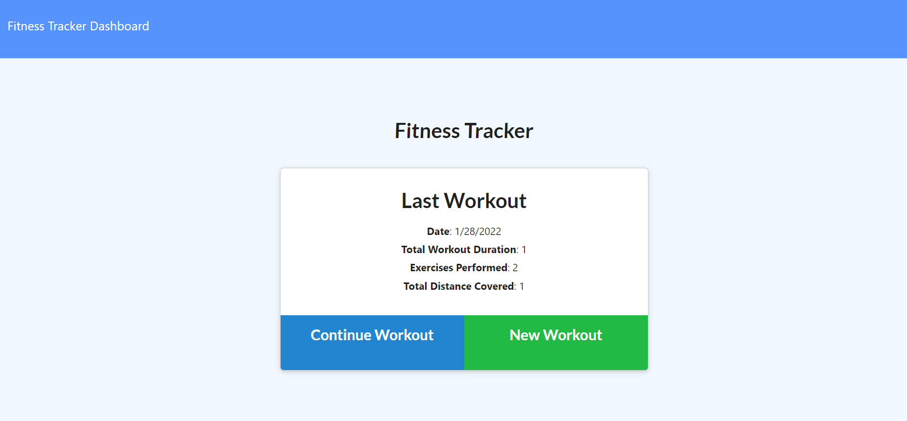
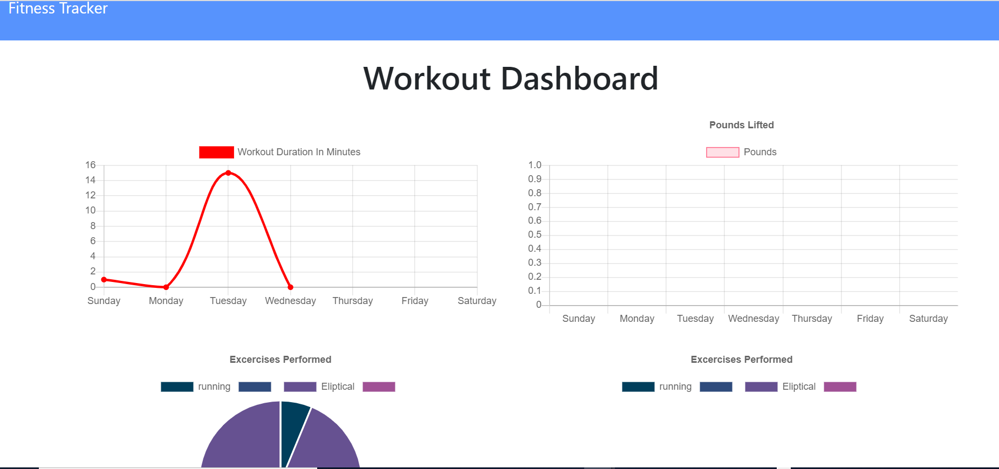

# Fitness Tracker

Track your workouts with Fitness Tracker. The app will keep track of every exercise in your workout. The app dashboard will display weekly summary graphs of all workouts done in a week.   

## User Story

 As a user,     
 I want to be able to view create and track daily workouts.     
 I want to be able to log multiple exercises in a workout on a given day.     
 I should also be able to track the name, type, weight, sets, reps, and duration of exercise.    
 If the exercise is a cardio exercise, I should be able to track my distance traveled.   

## Acceptance Criteria

When the user loads the page, they should be given the option to create a new workout or continue with their last workout.

The user should be able to:

  * Add exercises to the most recent workout plan.

  * Add new exercises to a new workout plan.

  * View the combined weight of multiple exercises from the past seven workouts on the `stats` page.

  * View the total duration of each workout from the past seven workouts on the `stats` page.
     

## Installation

- Clone repository. 
- npm install
- node server.js


## Screeshots

1. Homepage displaying last workout



2. Creating Workouts


3. Last Week's Summary



## Snippets


1. Adding to an array type

```javascript

    // add exercise
    app.put("/api/workouts/:id", (req, res) => {

        db.Workout.findOneAndUpdate(
            { _id: req.params.id },
            {
                $inc: { totalDuration: req.body.duration },
                $push: { exercises: req.body }
            },
            { new: true }).then(dbWorkout => {
                res.json(dbWorkout);
            }).catch(err => {
                res.json(err);
            });

    });
    
```
* This function will add an exercise to the array of exercises that belong to the workout with the given id. Here we will locate the workout with the given ID and update its fields. We will increase the total duration of the workout by the duration of the exercise being inserted. We will push the exercise to the array of exercises.


## Author

 - Daliya Benny

## Technology

HTML, CSS, Javascript, Bootstrap,  NodeJS,Express, MongoDB

   
## Links    
 - [Github](https://github.com/daliyaebenny/Fitness-Tracker.git/)    
 - [Deployed](https://infinite-caverns-58397.herokuapp.com/)

  

